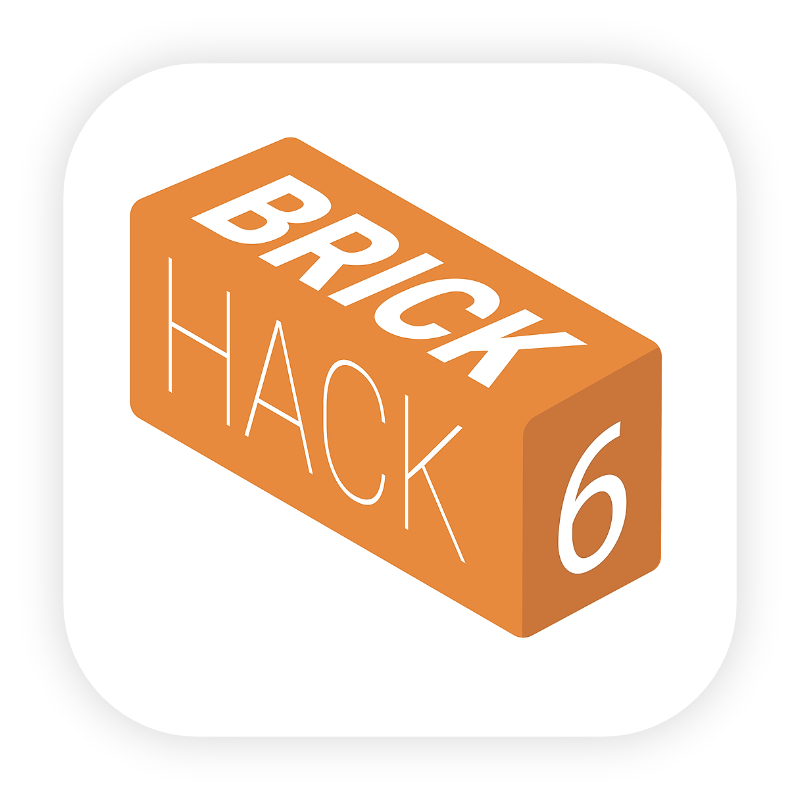

# BrickHack Mobile (iOS)


<div style="display: inline">

<a href="https://codeclimate.com/github/codeRIT/brickhack-mobile-ios">
	
</a>

<a href="https://apps.apple.com/us/app/brickhack-6/id1497794078?mt=8">
	
</a>
</div>

<p align="center">
	
</p>

<p align="center">
	
</p>

# Features 

The definitive app for BrickHack 6 attendees!

This app lets you:

* **View the Schedule:** Attendees are able to view the latest and greatest events as they happen, and view some basic information for each event..
* **Track events**: By favoriting events, users can get push notifications as those events start.
* **Access Resources:** View the Devpost, Slack, and call emergency services if needed.


# Setup

### Installing CocoaPods (and related project-level dependencies):

To install CocoaPods (and other dependencies), make sure you have ruby `2.6.3` or greater. The easiest way to do this on macOS is to set a global `rbenv` version as follows:
```
$ brew install rbenv ruby-build
$ rbenv install 2.6.3
$ rbenv global 2.6.3
```

And add rbenv to your `~/.bashrc` or `~/.zshrc`:
```
eval "$(rbenv init -)"
```
Or, for `fish` users, in your `~/.config/fish/config.fish`:
```
source (rbenv init - | source)
```
Next, install the `cocoapods-keys`gem:

(Note: May have to run with `sudo`)
```
$ gem install cocoapods-keys
```

Finally, run this to install `cocoapods` and its dependencies. 

```
$ bundle install
```
```
$ pod install
```

### API Keys

The complicated series of steps above means that on first `$ pod install`, CocoaPods will prompt for API keys that need to be set. 

- If you are an open-source contributor, please provide your own keys (e.g., [Google Sheets API Request](https://developers.google.com/sheets/api/guides/authorizing#APIKey)) as needed.
- If you are a member of codeRIT, ask the Engineering team lead for keys.

### .xcodeproj

Each developer needs to use and _not_ commit their own Bundle Identifier, and developer team. 

The App Store version uses `io.BrickHack.Mobile.peterkos`, but despite this, all locally run versions need to use a unique identifier. 


# Contributors

Thanks for your willingness to contribute!

While we normally welcome ideas, BrickHack 6 is over, so any updates to this app are moot.

Planning for BrickHack 7 will begin sometime in July 2020, so until then, give this repo a star and be on the lookout for updates!
